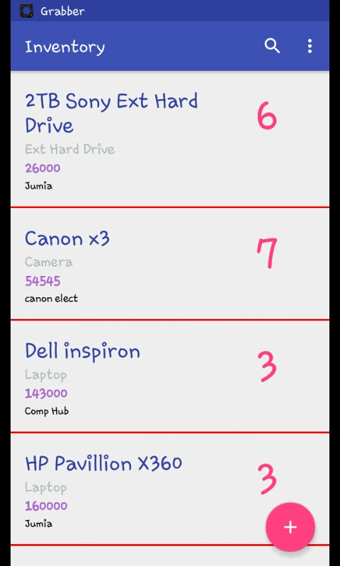
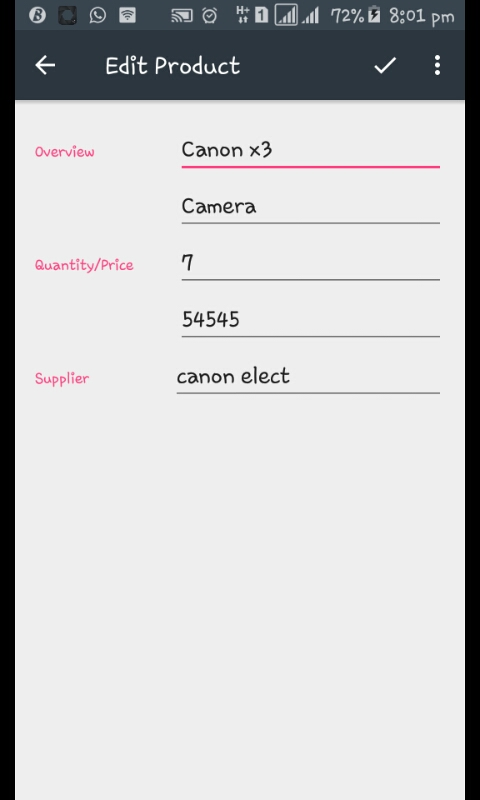

# Inventory

An android app that reads the content of an excel sheet in its asset folder. The read data is then written into an sqlite database. This was done using an old Jexcel api

[this Inventory](https://github.com/lollykrown/Inventory/app/main/Assets/products.xls)

   

